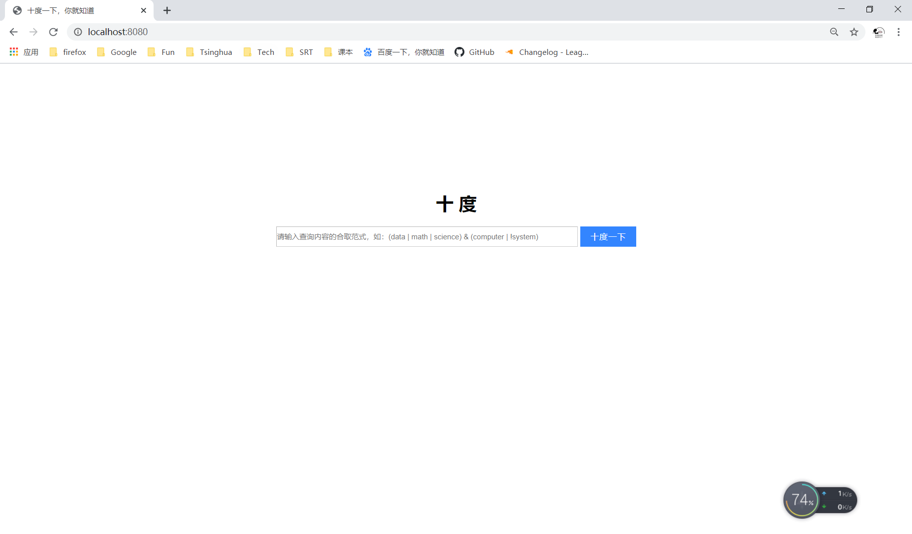
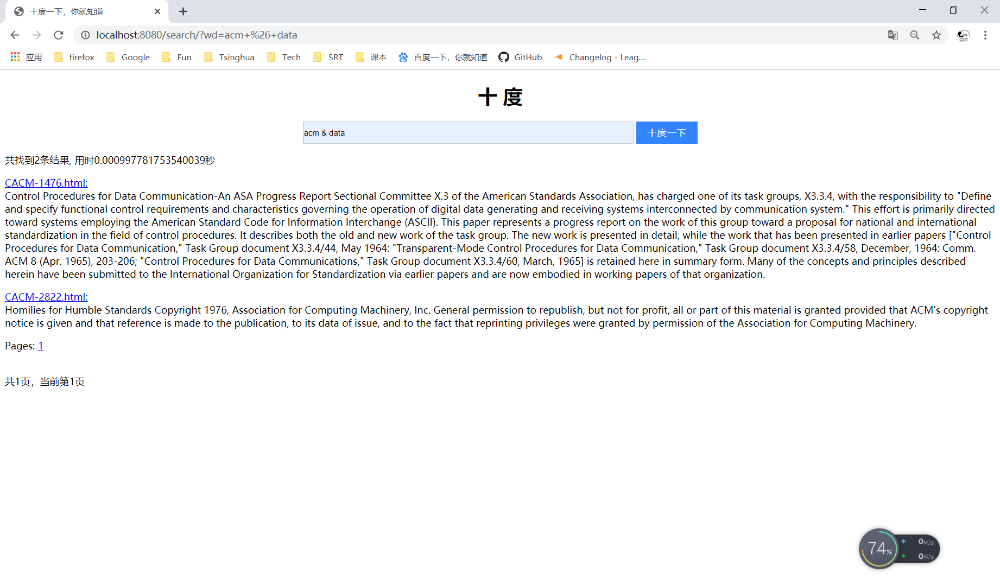
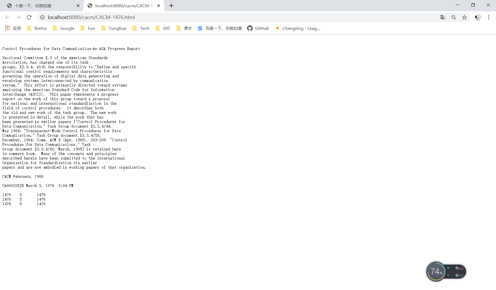
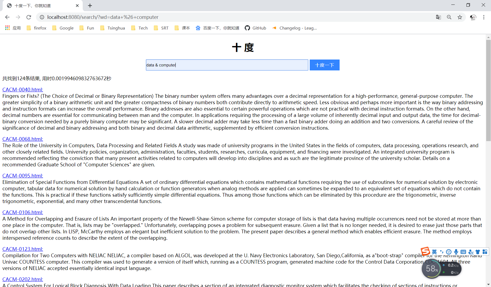
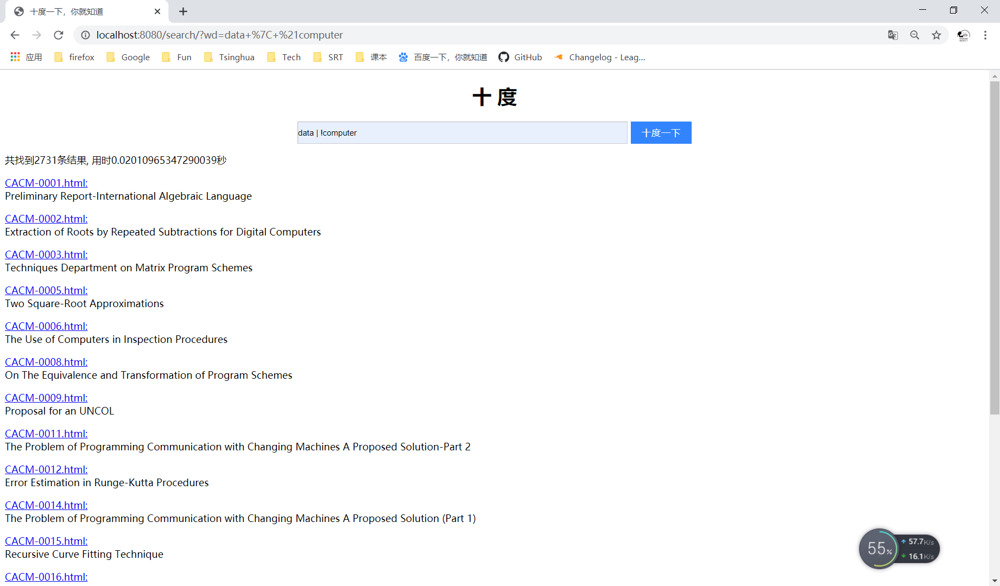

# 信息检索技术 第二次大作业

## 运行环境

* Python 3

* Windows 10

* Django 2.2.3

## 运行方法

1. run: 
   `python manage.py runserver ([port]=8000)`
   e.g. `python manage.py runserver 8080`

2. open your browser and go to [localhost:[port]](localhost:[port])
e.g. [localhost:8080](localhost:8080)

## 文件结构

* ```utils.py```——用于储存用到的数据结构和相关函数
* ```inverted_index.pkl```——倒排索引文件
* ```cacm```——数据集
* ```Backend```——Django生成的文件夹，用于处理后端逻辑
* ```SearchEngine```——Django生成的文件夹，用于全局设置
* ```db.sqlite3```——Django生成的数据库文件，本次作业没有用到
* ```manage.py```——用于运行程序

## 已实现功能

* 输入关键字，输出系统检索到的文档集
* 交互界面友好

## 界面说明

本次大作业是在第一次大作业的基础上做增量开发，由于检索模型不限，故使用的还是布尔模型。

本次大作业添加的主要功能为使用Django完成了界面交互，这里模仿百度的界面，做了一个“十度”，CSS样式参考了[https://blog.csdn.net/qq_35003667/article/details/78266517](https://blog.csdn.net/qq_35003667/article/details/78266517)并做了一定程度的改进。

主界面如下：



搜索结果界面如下：



点击结果中的HTML超链接，可以直接打开对应的HTML文件：



此外由于第一次大作业模块化做得比较好，因此本次作业完成得也比较轻松。

##  算法流程

```SearchEngine\urls.py```中定义了网页的跳转逻辑，```Backend\view.py```中定义了具体的后端逻辑。

具体算法流程如下：

* 用户进入主页面，```urls.py```向```view.py```发送主界面请求，```view.py```返回静态的网页```homepage.html```，即主界面。
* 用户输入需要检索的单词，点击搜索按钮后，网页将用户的输入包装为wd参数，发送GET方法，```urls.py```向```view.py```发送搜索请求，```view.py```根据wd参数处理得到搜索结果，并根据page参数截取结果的一部分，将其作为参数传给动态的网页```result.html```，其动态地显示搜索结果。
* 在```result.html```中用户的翻页只是将page参数修改，wd参数不变，再次发送GET方法。
* 在```result.html```中用户可以继续搜索，其逻辑与主界面的搜索相似，不再赘述。

## 实验结果

由于是布尔模型，因此无法给出量化的准确度，认为查询得到的结果中的单词与请求的逻辑相符合即正确。

查询data & computer，结果如下：



由于默认使用了skip_pointer，因此AND查询的速度还是比较快的。并且查询的结果中都有data和computer。

查询data | !computer，结果如下：



不出所料，OR NOT查询由于不能使用skip_pointer，需要遍历整个数据集，故速度慢了很多。且查询的结果与查询的逻辑是相符合的。

